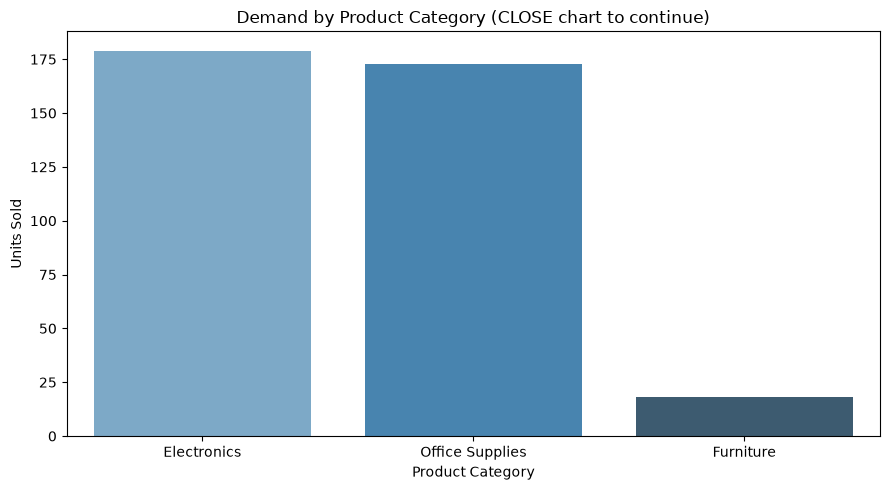
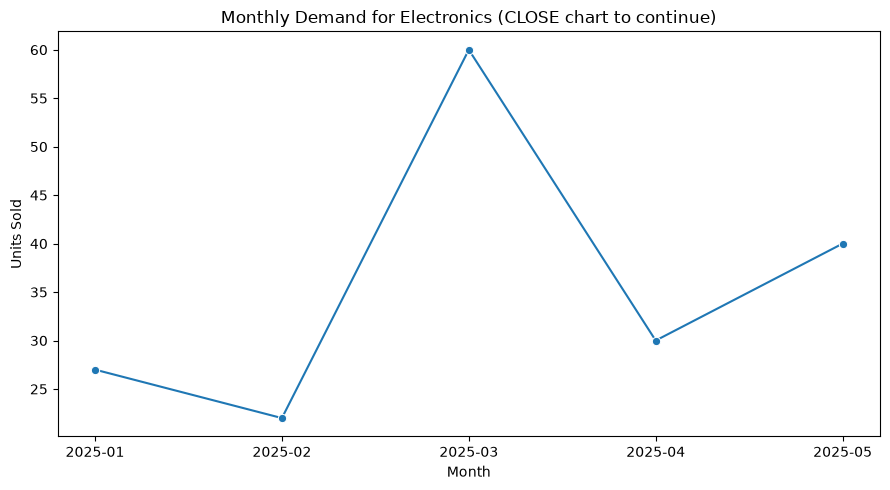

# Project Documentation

This site provides project documentation.
Use the documentation navigation to explore.

## How-To Guide

Many instructions are common to all our projects.

See
[⭐ **Workflow: Apply Example**](https://denisecase.github.io/pro-analytics-02/workflow-b-apply-example-project/)
to get the example projects running on your machine.

## Project Documentation Pages (docs/)

- **Home** - this documentation landing page
- [**Project Instructions**](./project-instructions.md) - the standard project workflow
- [**Your Files**](./your-files.md) - how to copy the example and create your version
- [**Glossary**](./glossary.md) - project terms and concepts
- [**API**](./api.md) - autogenerated code documentation for the public project interface

## Example Storytelling Question

The example project answers this business question:

> Which product category contributes the most sales in the selected region,
> and when are its sales strongest?

The example follows a general BI storytelling process:

1. Define one clear business question.
2. Identify the data needed to answer it.
3. Summarize the data.
4. Create charts that provide evidence.
5. Identify the most important results.
6. Explain the findings in your documentation.
7. Recommend an action or next question.

Your project should follow the same general process,
but answer a different business question.

## Phase 4. Technical Modification

### Modification Description

I modified the storytelling example project to compare sales between two regions instead of analyzing only one region.

### What I Changed
Changed the analysis from one selected region to two regions:
- East
- West
- Updated the sales summary functions to handle both regions.
- Updated chart titles:
  - Sales by Category: East vs West
  - Monthly Office Sales: East vs West
- Updated the key-results output to report both regions

### Why I Chose This Change

I chose this modification because comparing regions provides more useful business insight than analyzing only one region. It helps identify category performance and sales trends across markets.

### Verification

I verified the change by running:

- uv run python -m bizintel.storytelling_modi_case

- The workflow completed successfully and generated the updated charts.

- Confirmed results:

Compared regions: East and West
Leading category: Office
Leading category sales: $612,390.42
Strongest month: 2025-05

### Difference From the Example

The original example analyzed only the East region. The modified version compares East and West, making the analysis more useful for business decisions.

## Reflection

The modification was more challenging than expected because changing from one region to two required updates across filtering, functions, charts, and reporting. The main challenge was keeping all parts of the workflow consistent.

## Phase 5. Custom Project

# Retail Inventory Storytelling Project

## Basis and Problem

This project analyzes retail inventory transaction data to identify which product category has the highest demand and determine when inventory levels should be increased.

The original dataset started as: data/raw/retail_inventory_case.csv

The raw dataset contained inventory transactions with the following fields:

- TransactionID
- SaleDate
- ProductID
- ProductName
- Category
- Region
- QuantitySold
- UnitPrice
- InventoryBeforeSale

The analysis focused on the following columns:

### Column and Purpose

| Category | Used to compare product demand across categories |
| ProductName | Used to identify products within categories |
| QuantitySold | Used as the demand measure |
| SaleDate | Used to create monthly demand trends |

These columns were selected because they directly support inventory planning decisions.

### Data Limitations

The analysis has several limitations:

- The dataset contains a limited number of transactions.
- Demand patterns may change with larger datasets.
- External factors such as promotions, seasonality, and supplier constraints are not included.
- The results should support planning decisions but should not be the only factor used for inventory decisions.

---
# Business Question

**Which product category has the highest demand, and when should inventory levels be increased?**

This question matters because inventory managers need to understand which product categories require greater stock availability.

The answer supports decisions such as:

- Increasing inventory levels before high-demand periods
- Prioritizing purchasing decisions
- Reducing the risk of stock shortages

The recommended action is to monitor high-demand categories and increase inventory preparation before historically strong sales periods.

---

# Analysis Approach

The analysis followed a Business Intelligence storytelling workflow.

The reporting dataset used was: data/reporting/retail_inventory_reporting_case.csv

The analysis steps were:

1. Loaded the reporting-ready inventory dataset.
2. Grouped data by product category.
3. Aggregated total demand using: TotalQuantitySold
4. Sorted categories from highest to lowest demand.
5. Selected the highest-demand category.
6. Filtered the reporting data to that category.
7. Grouped the selected category by month.
8. Created charts showing:
   - Demand comparison by category
   - Monthly demand trend for the selected category

The first analysis identified the category requiring additional investigation.
The second analysis explained when demand for that category was strongest.

---

# Charts and Evidence

## Chart 1: Demand by Product Category

This chart compares total demand across product categories.

The evidence shows that:

- Electronics had the highest demand.
- Electronics generated 179 units sold.
- Electronics became the focus of the deeper monthly analysis.

---

## Chart 2: Monthly Demand Trend for Electronics

This chart examines Electronics demand over time.

The evidence shows:

- Demand changed throughout the year.
- The strongest month was March 2025.
- Electronics demand reached 60 units during the peak month.

---

# Findings and Recommendation

The analysis found that:

- Electronics was the highest-demand product category.
- Total Electronics demand was 179 units.
- March 2025 had the strongest Electronics demand with 60 units sold.

The result suggests that Electronics inventory should receive additional planning attention.

## Recommendation

Inventory managers should increase Electronics stock preparation before periods showing stronger demand patterns.

A reasonable next step would be:

- Analyze additional years of inventory data to confirm whether March demand is a repeating seasonal pattern.
- Include supplier lead times and current inventory levels for more precise ordering decisions.

---

# Storytelling Summary

This custom BI storytelling project addressed the business question:

**Which product category has the highest demand, and when should inventory levels be increased?**

The project started with retail transaction data containing product, category, sales quantity, and inventory information.

The analysis transformed reporting-ready data into business insight by:

- Comparing demand across product categories
- Identifying the highest-demand category
- Investigating monthly demand patterns

The main result was that **Electronics had the highest demand with 179 units sold**, and **March 2025 represented the strongest demand period with 60 units sold**.

The insight produced was that inventory planning should prioritize Electronics availability before high-demand periods.

This project demonstrated how BI storytelling connects data analysis with business decisions. The same process can support many business intelligence tasks by turning operational data into clear findings, recommendations, and actions.
